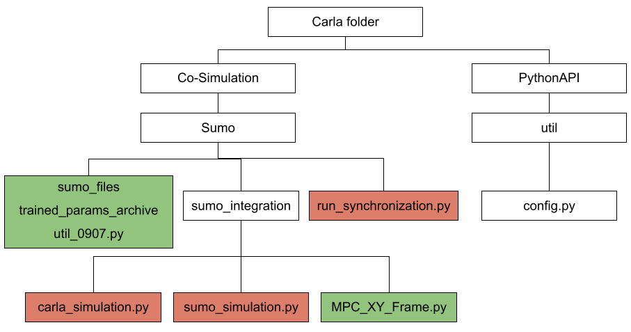

# Multi-Vehicle Trajectory Prediction at Intersections using State and Intention Information

## Abstract
Traditional approaches to prediction of future trajectory of road agents rely on knowing information about their past trajectory. This work rather relies only on having knowledge of the current state and intended direction to make predictions for multiple vehicles at intersections. Furthermore, message passing of this information between the vehicles provides each one of them a more holistic overview of the environment allowing for a more informed prediction. This is done by training a neural network which takes the state and intent of the multiple vehicles to predict their future trajectory.  Using the intention as an input allows our approach to be extended to additionally control the multiple vehicles to drive towards desired paths. Experimental results demonstrate the robustness of our approach both in terms of trajectory prediction and vehicle control at intersections.


## Results
* Controlling vehicles without message passing (baseline) [[video]](https://drive.google.com/file/d/1AdF94g7Gd6ytB8gMKFR0qGHDBQH6qtnC/view?usp=share_link)
* Controlling vehicles with message passing. [[video]](https://drive.google.com/file/d/1V74KRbbgGNnIJ3vWwqs3vQ9wO5Y01D2S/view?usp=share_link)

## Setup

### 1) Packages Install

``` bash
conda create -n mvn python=3.7
conda install pytorch==1.11.0 torchvision==0.12.0 torchaudio==0.11.0 cudatoolkit=11.3 -c pytorch
conda install pyg -c pyg
conda install matplotlib
conda install -c conda-forge cvxpy
conda install -c anaconda lxml
```

### 2) Software Install
* CARLA: 0.9.10
* SUMO: 1.13.0

## Run the Inference code

### 1) Put the inference code and the map in place

First navigate to the directory where Carla installed, then copy the directories and the scripts in this repository and put them in the correct place as the following image shown. 



*Red: the existing script or directory needs to be replaced*

*Green: a new created script or directory*


### 2) Activate our map in CARLA

First execute carla.exe or carla.sh, then run the following commands: 
```bash
conda activate mvn

cd ${Carla_folder}/PythonAPI/util

python config.py -x ../../Co-Simulation/Sumo/sumo_files/map/map_15m.xodr
```
Now the intersection scenario should be already ativated!

### 3) Run the inference code
If the above steps all work properly, we can finally run the inference code to control the vehicles at this intersection, just run the following commands:
```bash
cd ${Carla_folder}/Co-Simulation/Sumo

python run_synchronization.py  sumo_files/sumocfg/09-11-15-30-00400-0.09-val_10m_35m-7.sumocfg  --tls-manager carla  --sumo-gui  --step-length 0.1
```

## Try to Train Your Model
In this repository, we also release the code for generating data from the SUMO simulator and training the model on your own. 
### 1) Generate the dataset from SUMO
First, you can use generate_csv.py to generate the training set and validation set from SUMO by running:
```bash
python generate_csv.py --num_seconds ${length of the generated sequence (unit: second)} --split ${train or val}
```
The data (.csv format) will be generated in `csv` folder.

### 2) Train the model
Once the training set and validation set are obtained, you can begin to train your model by running:
```bash
python train_gnn.py --train_folder ${path to the training set} --val_folder ${path to the validation set} --epoch ${number of total training epochs}
```
Once the training process is finished, you can find the trained weights in `trained_params` folder. 

### 3) Run the inference on CARLA-SUMO co-simulation
If the above steps all work properly, now you can use the weights trained on your own to control the vehicles at the intersection as we showed you before.